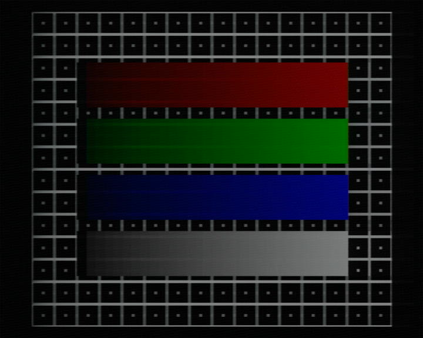
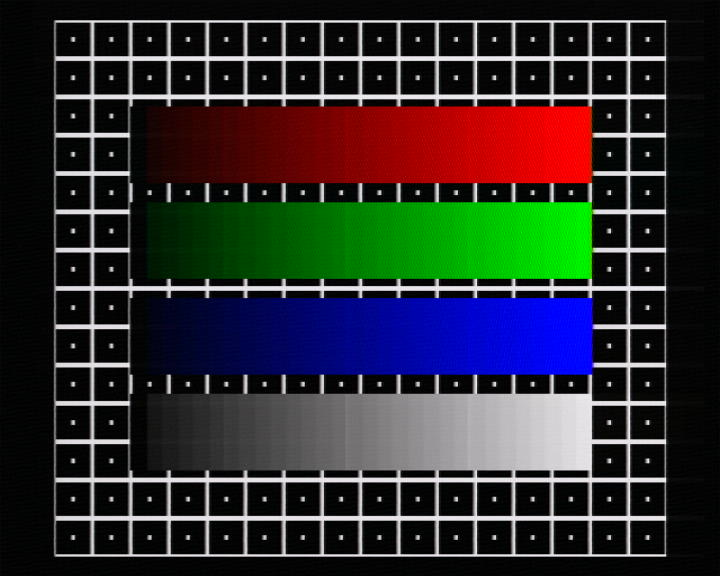
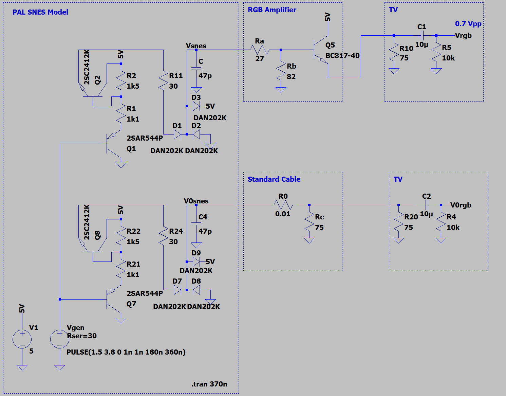
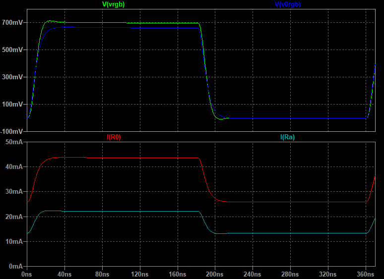
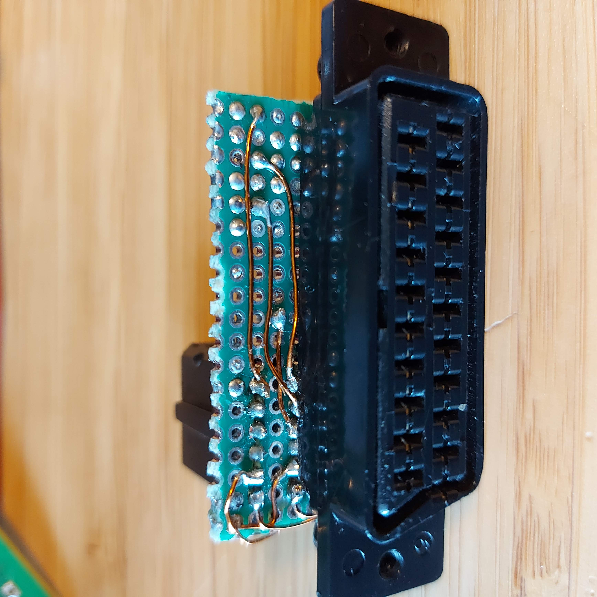
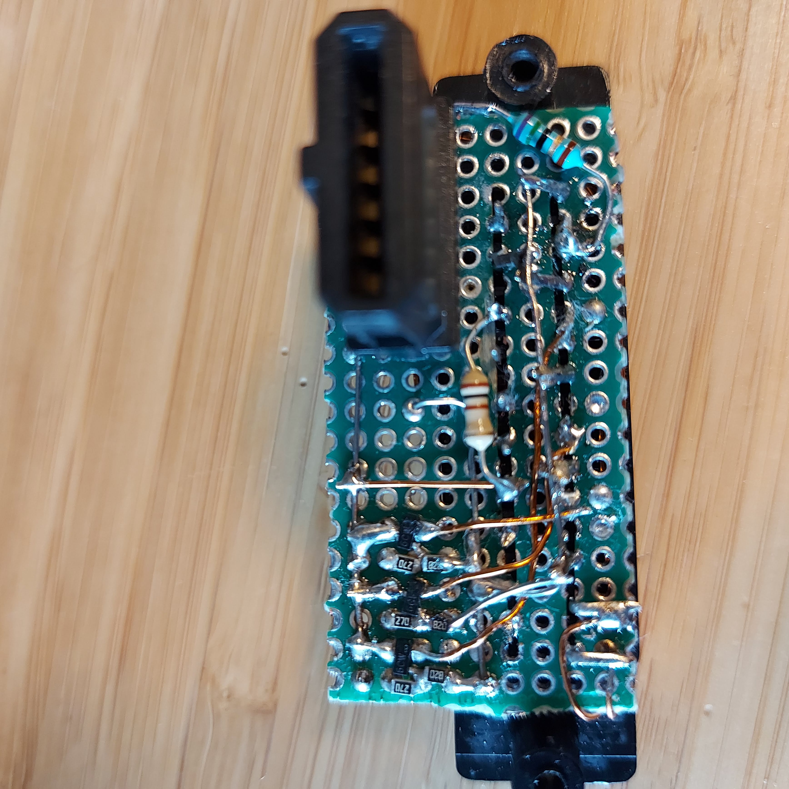
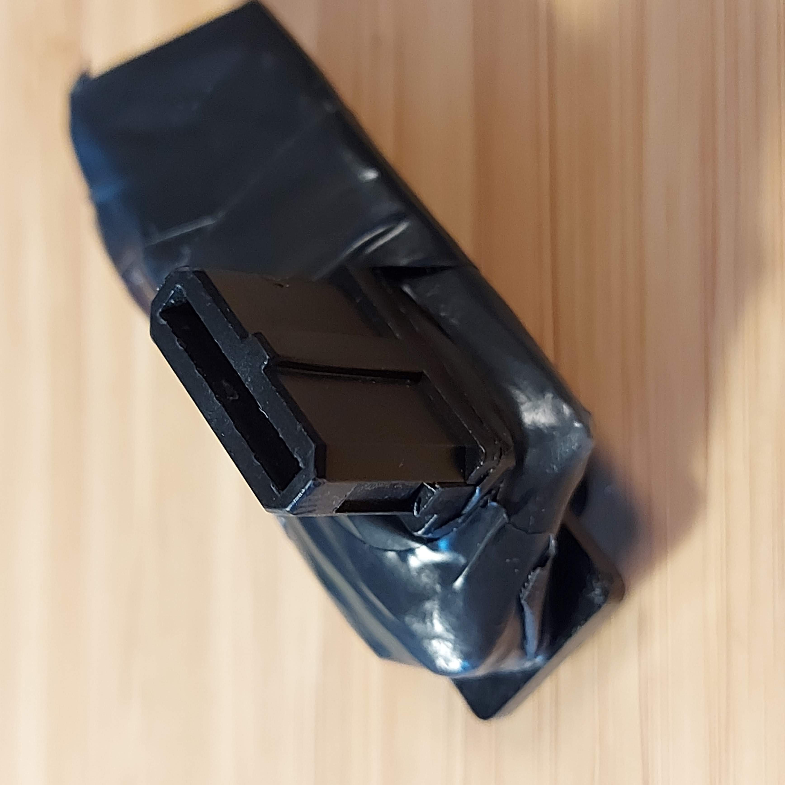
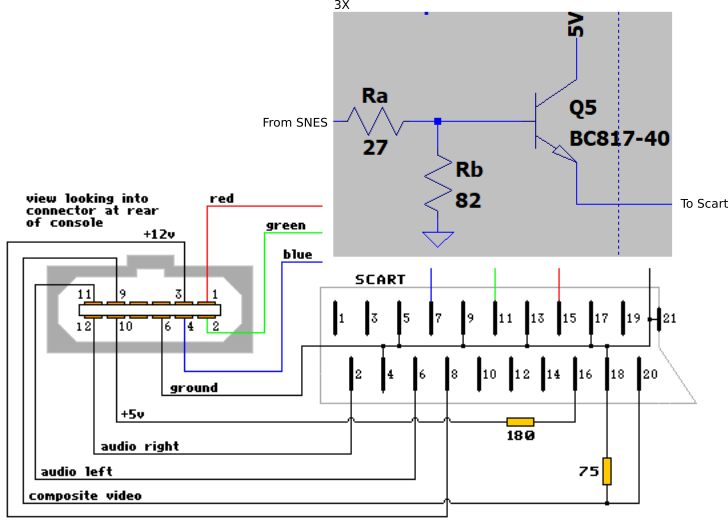

# PAL SNES RGB Amplifier

My PAL "2 CHIP" SNES had petty bad RGB output and it became even worse when using it with a Scart switch and other consoles. I knew that it's possible to make an RGB bypass mod, but I wanted to try to make somthing that didn't required an internal mod. I started with making a model of the output stage in LTSpice from the schematics of the PAL SNES. It has a wierd circuit! I tried many diffrent circuits to make a buffer that isolates the signal and finaly came up with a farly simple design.

The image was dim and had ghosting and this how it initialy looked with 240P Test suit. 

 

This with my circuit.

This is the model of the SNES and my design. It also have a model standard cabel for reference.

The intresting parameters are Ra and Rb that sets the reslut. I adjusted them to get about the same peek to peek voltage as the original cable. I also tried a few diffrent values and using a real SNES. It seemd like the image got a huge improvement by making the impdance a bit higer seen from the SNES output (this also means lower current).

 

I asume that putting the buffer as close as possible to the port is benfitial so made a module that i plug in to the back of the consle. But my guess is that it should also work pretty well if it is place in a regualar Scart cable housing with a (short) cable.

 

I used surface mounted BC817 transistors but any smal signal NPN transistor like BC547B, BC337 or 2N3906 should also work fine.

As the multi out connector provides 5 Volt there is no need to us an power supply. The connections are the same a normal PAL Scart cabel but with the buffers insted of the 75 ohm resistor to ground.

 

